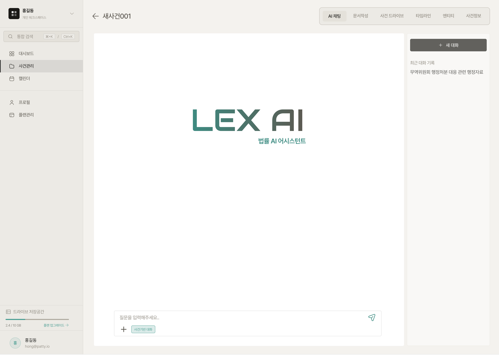
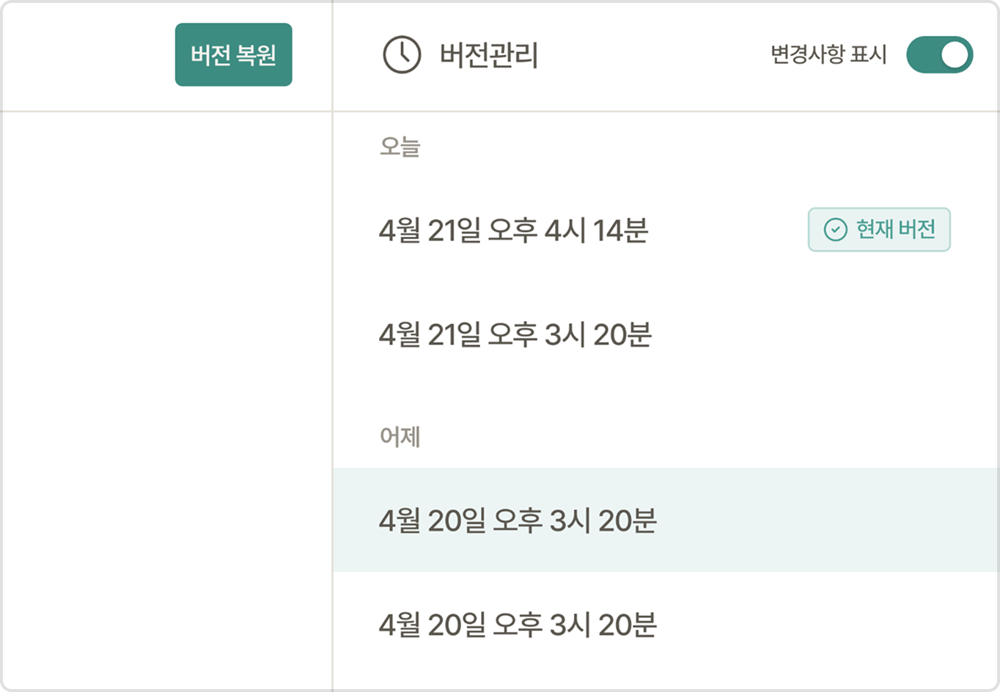
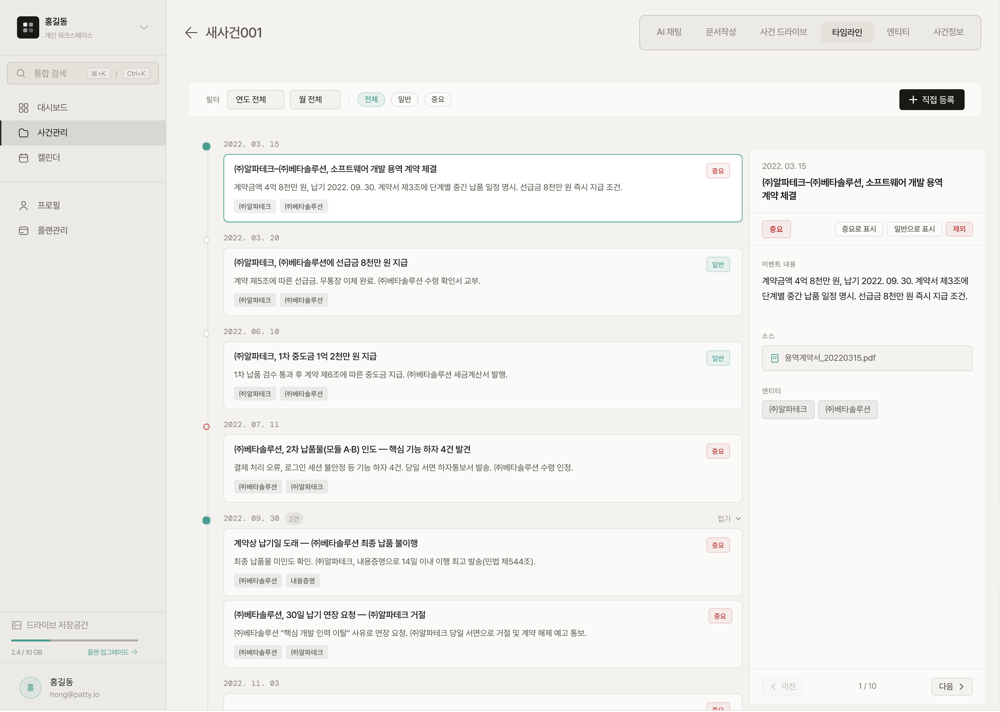
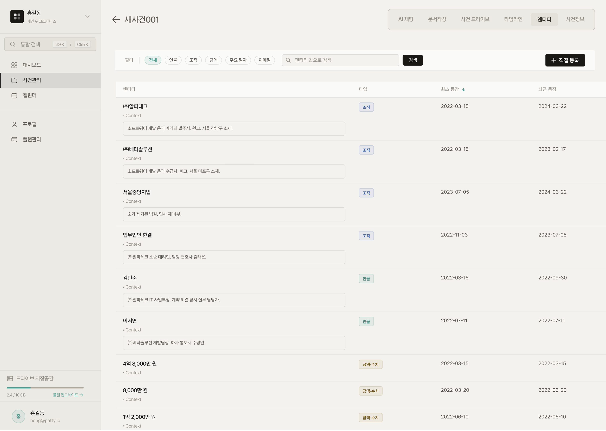

# 사건관리

## 사건 생성

<figure><figcaption></figcaption></figure>

사건 관리에서 새 사건 생성 버튼을 클릭한 후 사건명, 의뢰인명, 첨부파일, 사건설명을 입력하여 사건을 생성합니다. 첨부한 파일은 자동으로 사건 드라이브에 저장되며, 사건 설명은 AI가 사건의 최초 맥락을 파악하는데 활용됩니다.

***

## AI 채팅

<figure><figcaption></figcaption></figure>

사건생성 후 기본 화면입니다. 사건기반 대화 모드를 선택 후 업로드하신 파일은 사건 드라이브에 자동 저장됩니다. 사건 기반 대화 모드를 선택하지 않을 경우 사건과 무관한 일반 법률 질의응답이 가능하며 파일 업로드는 일회성으로만 참조됩니다. 또한 최근 대화 기록을 제공하여 이전 대화를 손쉽게 살펴볼 수 있습니다.

***

## 문서 작성

문서 작성은 빈 문서로 시작하거나, 준비서면·소장 등 자주 쓰는 양식을 템플릿으로 불러와 시작할 수 있습니다. HWP, HWPX, Word 파일을 업로드하면 에디터에서 바로 이어서 편집할 수 있습니다.


**템플릿 제공**

민사, 형사, 행정, 가사·상속, 신청·집행, 회생·파산 총 6개의 카테고리 내에 사건 기반 데이터 결합성과 서술 부하도가 높은 템플릿을 제공하여, AI가 사건 정보와 드라이브 파일을 참조해 초안을 빠르게 완성할 수 있도록 지원합니다.


### 문서 에디터 주요 기능



<figure><figcaption></figcaption></figure>

#### AI 편집 (허용/비허용)

채팅으로 AI에게 편집을 요청하면 변경된 내용이 문서에 바로 표시되어 기존 내용과 즉시 비교할 수 있습니다. 원하는 부분만 선택적으로 반영하거나 전체를 되돌리는 것도 가능합니다.



<figure><figcaption></figcaption></figure>

#### 드래그하여 AI로 다듬기

‘다르게 표현’, ‘내용 확장’, ‘간결하게 표현’, ‘개요형식으로 정리’, ‘문법 및 오탈자 수정’ 등의 기능을 활용하실 수 있습니다. 또한 프롬프트 입력창에 "주장을 좀 더 강경한 어조로 변경해 줘" 등을 요청할 수 있습니다.



<figure><figcaption></figcaption></figure>

#### 버전 관리

문서를 저장할 때마다 변경 이력이 자동으로 기록됩니다. 과거 버전을 열어 현재 문서와 나란히 비교하거나, 특정 시점으로 즉시 복원할 수 있어 장기 사건의 문서 이력 추적에 유용합니다.



<figure><figcaption></figcaption></figure>

#### 댓글 및 메모

문서 내 특정 문장이나 단락을 선택해 댓글을 남기면 해당 위치에 고정되어 표시됩니다. 조직 멤버 간 검토 의견을 주고받거나 수정 요청을 구체적인 위치와 함께 전달할 수 있습니다.



***

## 사건 드라이브

<figure><figcaption></figcaption></figure>

사건 드라이브는 해당 사건과 연결된 파일을 업로드하고 관리하는 전용 저장공간입니다. 드라이브에 저장된 파일은 AI가 지속적으로 참조하는 데이터로 활용됩니다. 사건기반 모드를 키고 진행한 채팅에서 파일을 직접 첨부할 시 사건 드라이브에 자동으로 저장됩니다.

***

## 타임라인

<figure><figcaption></figcaption></figure>

사건의 진행 과정을 시간순으로 확인할 수 있습니다. 파일 업로드, 문서 생성, 결재 등 주요 이벤트가 자동으로 기록되며, 수동으로 이벤트를 추가하거나 수정할 수도 있습니다.&#x20;

***

## 엔티티

<figure><figcaption></figcaption></figure>

사건 관련 파일과 문서에서 인물, 기관, 금액, 날짜, 이메일 등의 주요 사항을 AI가 자동으로 추출하고 카테고리별로 정리합니다. 직접 추가·수정할 수도 있습니다.&#x20;

***
