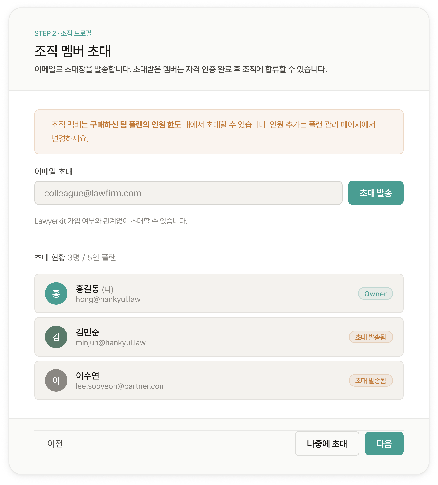

# 멤버 초대 및 권한

## 멤버 초대

<figure><figcaption></figcaption></figure>

조직을 생성한 후 이메일로 초대장을 발송합니다. Lawyerkit 가입 여부와 관계없이 초대할 수 있습니다. 초대받은 멤버는 자격 인증 완료 후 조직에 합류할 수 있습니다.


**조직 플랜 안내**

조직 멤버는 구매하신 팀 플랜의 인원 한도 내에서 초대할 수 있습니다. 인원 추가는 플랜 관리에서 관리하실 수 있습니다.


## 권한 체계 

<table><thead><tr><th width="105.78515625">권한</th><th>설명</th></tr></thead><tbody><tr><td><strong>Owner</strong></td><td>조직 생성자. 조직 관리 전체 권한을 가집니다.</td></tr><tr><td><strong>Editor</strong></td><td>사건 내 새 문서 생성, 타임라인·엔티티 수정, 사건 드라이브 파일 업로드·삭제가 가능합니다.</td></tr><tr><td><strong>Viewer</strong></td><td>사건 관련 모든 내용을 읽기 전용으로 확인할 수 있습니다. 문서에는 댓글만 작성할 수 있습니다.</td></tr></tbody></table>


**사건별 권한**

멤버를 특정 사건에 연결하면 해당 사건에만 접근 권한이 부여됩니다. 기본값은 뷰어이며, 에디터 권한은 별도로 지정해야 합니다.


***
